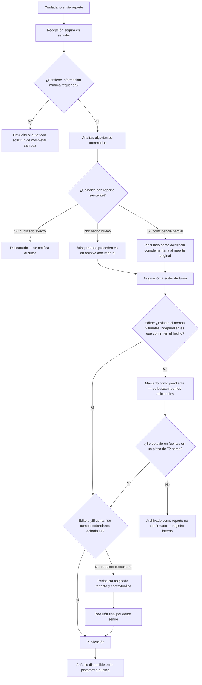

  

<strong>Venezuela sin filtro.</strong> 
Periodismo independiente. Datos verificables. Sin agenda.

  <a href="https://www.libertadvzla.com">Sitio</a> ·
  <a href="https://www.libertadvzla.com/news">Noticias</a> ·
  <a href="https://www.libertadvzla.com/victims">Memoria Viva</a> ·
  <a href="https://www.libertadvzla.com/reportar">Reportar</a> ·
  <a href="https://www.libertadvzla.com/about">Acerca</a>

  <em>Plataforma de periodismo ciudadano verificado para Venezuela. Recolecta, verifica y preserva reportes documentales en entornos donde la información independiente es restringida.</em>

---

## 1. Qué es Libertad VZLA

**Libertad VZLA** es una plataforma de periodismo ciudadano y verificación documental diseñada para operar en entornos donde el acceso a la información independiente es restringido.

El sistema recibe reportes directos de ciudadanos, los contrasta con fuentes documentales y registros históricos, aplica capas de verificación — tanto algorítmica como humana — y publica información contrastada de interés público.

No es un medio de opinión. No es un blog. Es una plataforma de verificación documental que procesa reportes ciudadanos.

**Acceso público:** [libertadvzla.com](https://www.libertadvzla.com)

---

## 2. Por qué fue necesario construir esto

### 2.1. El desmantelamiento progresivo de la prensa (2013–2024)

Desde 2013, bajo la administración de Nicolás Maduro, Venezuela experimentó un desmantelamiento progresivo de los medios independientes. No fue un proceso accidental; respondió a decisiones deliberadas y documentadas:

- **Cierre masivo de medios:** Más de 400 emisoras de radio clausuradas. La práctica totalidad de los medios impresos críticos desaparecieron, fueron adquiridos por grupos cercanos al gobierno o fueron asfixiados económicamente. (Fuente: Sociedad Interamericana de Prensa — SIP)
- **Redes de desinformación coordinada:** Desde 2010, el gobierno promovió la creación de estructuras denominadas *guerrillas comunicacionales* — colectivos organizados para saturar plataformas digitales con narrativas oficiales, hostigar a periodistas y manipular tendencias. (Fuente: LatAm Journalism Review)
- **Legislación como herramienta de censura:** La Ley Contra el Odio (2017) y la Ley de Fiscalización de ONG (2024) fueron utilizadas para criminalizar la crítica, restringir la financiación de organizaciones de verificación y forzar el exilio de profesionales de la comunicación.

Para 2024, Venezuela ocupaba el puesto 160 en el Índice Mundial de Libertad de Prensa (RSF). La SIP la clasificó, junto a Nicaragua, como país **"sin libertad de expresión"**.

### 2.2. El 28 de julio de 2024 y lo que vino después

Las elecciones presidenciales del 28 de julio de 2024 marcaron un antes y un después.

El Consejo Nacional Electoral (CNE) proclamó la reelección de Nicolás Maduro con el 51,20% de los votos, habiendo escrutado el 80% de las actas. La oposición, representada por María Corina Machado y Edmundo González Urrutia, rechazó los resultados. Según sus propios registros — basados en el 40% de las actas que lograron resguardar — González habría obtenido aproximadamente el 70% de los sufragios.

Lo que siguió fue una escalada represiva documentada por múltiples organizaciones:

- **2.000+ detenciones** en protestas post-electorales.
- **28 fallecidos** según informes de organizaciones de derechos humanos.
- **1.229 detenciones políticas** documentadas por Foro Penal entre el 29 de julio y el 8 de agosto.
- **14 periodistas detenidos arbitrariamente** en 2024, 11 de ellos después del 28J. (Fuente: IPYS Venezuela)
- **566 violaciones a la libertad de prensa** registradas hasta diciembre de 2024 — un incremento del 64% respecto a 2023.

### 2.3. El cerco digital

Simultáneamente, se desplegó la ofensiva de censura digital más agresiva en la historia del país:

- **79 sitios web bloqueados** entre julio de 2024 y enero de 2025. Portales como TalCual, Runrunes, El Estímulo y Medianálisis dejaron de ser accesibles para millones de venezolanos. (Fuente: VE Sin Filtro)
- **Bloqueo de herramientas de evasión:** CANTV, el proveedor de internet estatal, bloqueó intermitentemente los servidores DNS públicos de los principales proveedores globales.
- **Restricción de redes sociales:** X (anteriormente Twitter) y TikTok sufrieron bloqueos parciales o totales.
- **23 medios adicionales cerrados** en 2024, incluyendo 21 emisoras de radio. (Fuente: Espacio Público)

### 2.4. La decisión

El **10 de diciembre de 2024** — Día Internacional de los Derechos Humanos —, un grupo reducido de ciudadanos venezolanos tomó una decisión que llevaba meses gestándose: comenzar a construir.

No fue un manifiesto. Fue una conclusión lógica frente a un escenario concreto: la infraestructura de prensa independiente estaba siendo eliminada, las vías digitales de evasión estaban siendo cerradas una por una, y no existía una plataforma con la resiliencia técnica necesaria para funcionar bajo ese nivel de hostilidad.

El grupo — ingenieros, periodistas exiliados, analistas de fuentes abiertas y ciudadanos con experiencia en documentación cívica — se hizo una pregunta concreta: **¿Es posible construir un canal de información ciudadana que resista bloqueos, censura y persecución legal, sin sacrificar la rigurosidad periodística?**

Los meses siguientes se dedicaron a responder esa pregunta:

1. **Documentar los mecanismos técnicos de censura** empleados por el Estado, sus patrones y sus puntos ciegos.
2. **Establecer canales seguros con periodistas exiliados y fuentes dentro del país**, construyendo una red de verificación humana con personas que ya operaban bajo condiciones de riesgo.
3. **Diseñar un canal de ingesta de información ciudadana** que protegiera la identidad de los reporteros.
4. **Desarrollar un modelo de procesamiento de lenguaje propio**, calibrado con corpus del ecosistema informativo venezolano y latinoamericano. Un sistema con capacidad de comprensión semántica, análisis de sentimiento, memoria contextual de largo plazo y detección de patrones de desinformación.
5. **Implementar mecanismos de escucha social** para monitorear la actividad de redes de desinformación coordinada y detectar campañas de manipulación antes de que escalen.

---

## 3. Estado actual

La plataforma está en operación pública desde el **1 de mayo de 2026**.

| Estado | Componente |
|:-------|:-----------|
| ✔ Operativo | Plataforma desplegada y accesible públicamente |
| ✔ Operativo | Sistema de registro con seudonimato funcional |
| ✔ Operativo | Flujo de publicación editorial con verificación |
| ✔ Operativo | Sistema de almacenamiento y recuperación de datos |
| ✔ Operativo | Autenticación con separación de identidad pública/privada |
| ✔ Operativo | Memoria Viva (registro documental de presos políticos) |
| ⚠ En expansión | Red de verificación ciudadana |

---

## 4. Cómo funciona

### 4.1. El ciudadano en la cadena informativa

La plataforma no funciona como un medio tradicional con redacción cerrada. Implementa un modelo distribuido donde los ciudadanos participan directamente, asumiendo roles progresivos según su nivel de compromiso y su historial dentro del sistema:

| Rol | Qué hace | Cómo accede |
|:---|:---|:---|
| **Testigo** | Envía reportes sobre hechos que observó o documentó directamente. | Registro verificado en la plataforma. |
| **Reportero ciudadano** | Complementa reportes con fotografías, documentos o testimonios cruzados. | Historial de reportes verificados. |
| **Verificador** | Participa en el contraste de información con fuentes independientes. | Por invitación del equipo editorial. |
| **Periodista** | Redacta, contextualiza y publica artículos con base en reportes verificados. | Credenciales profesionales validadas. |
| **Administrador** | Gestiona la plataforma, aprueba roles avanzados y supervisa la Memoria Viva. | Equipo fundador. |

Cada reporte que supera el proceso de verificación construye un **índice de confianza** interno, medible y auditable. El sistema prioriza información de fuentes con historial comprobado, sin necesidad de conocer la identidad civil del ciudadano.

### 4.2. Cómo procesa el sistema un reporte

Si eres testigo de un hecho de interés público en Venezuela, el sistema procesa tu información bajo estas garantías:

1. **Ingreso y separación.** El ciudadano envía el reporte. Inmediatamente, la plataforma separa su identidad (cifrada y aislada) del contenido del reporte para evitar correlaciones de ataque.
2. **Validación asimétrica.** Todo esquema, metadata e integridad se verifica en el servidor. El cliente no procesa reglas, evitando cualquier manipulación en navegador.
3. **Búsqueda algorítmica y triangulación.** El nuevo reporte se transforma vectorialmente y se compara con el archivo histórico. El motor agrupa reportes del mismo evento y detecta anomalías.
4. **Revisión aislada.** El caso anonimizado pasa a la cola de un periodista verificado, quien inicia el protocolo de contraste (mínimo, requerir dos fuentes cruzadas comprobables).
5. **Consolidación e inmutabilidad.** Al verificarse, genera un hash inmutable. La información publicable sale al mundo; la identidad de las fuentes jamás.

### 4.3. Ejemplo de uso real en contexto

**Escenario:** Documentación de un operativo o detención irregular sin acceso a grandes medios.

- **La situación:** Un ciudadano, desde un barrio intervenido, presencia detenciones en bloque.
- **La acción:** Abre su sesión bajo seudónimo en *Libertad VZLA*. Sube 2 fotos y redacta un reporte de contexto. Cierra la sesión inmediatamente.
- **La respuesta del sistema:**
  1. El sistema sanitiza las imágenes, eliminando la metadata EXIF localmente y extrayendo las horas del pixelado, para finalmente cifrarlas.
  2. El algoritmo detecta otros dos reportes en la misma ubicación que ocurrieron con 15 minutos de diferencia. Cruza la información.
  3. Crea un macro-evento y levanta una alerta naranja en la mesa editorial.
  4. Los periodistas y voluntarios contactan fuentes oficiales. Al verificar que las personas han desaparecido del retén principal, se activa un registro en Memoria Viva, protegiendo la visibilidad para las agrupaciones legales.

### 4.4. El flujo de verificación

El flujo opera sobre dos principios:

1. **Capa algorítmica.** El sistema convierte cada reporte en una representación numérica y la compara contra todo el archivo documental de la plataforma. Detecta duplicados, identifica precedentes y sugiere conexiones — todo esto antes de que un ser humano intervenga. No genera contenido: analiza y clasifica.
2. **Capa editorial.** Ningún contenido se publica sin que un editor senior lo haya verificado contra un mínimo de dos fuentes independientes. El periodista asistido por el sistema redacta y contextualiza; el editor aprueba.

### 4.5. Memoria Viva

Después del 28 de julio de 2024, la cantidad de detenciones políticas en Venezuela superó la capacidad de seguimiento de la mayoría de las organizaciones. Las familias no tenían acceso centralizado a información sobre el estado procesal de sus familiares. Las actualizaciones se dispersaban entre comunicaciones informales, notas de prensa esporádicas y declaraciones de ONG con recursos limitados.

Libertad VZLA construyó un módulo específico para abordar esto: la **Memoria Viva**.

No es un listado. Es un archivo estructurado, actualizable y auditable de personas detenidas por motivos políticos en Venezuela.

**Lo que implementa:**

- **Fichas individuales verificadas** con información procesal, ubicación de reclusión (cuando se conoce), estatus legal y cronología de eventos documentados.
- **Acceso diferenciado por rol.** Administradores y periodistas acreditados actualizan registros. Verificadores cruzan datos. Ciudadanos consultan información pública.
- **Canal de participación familiar.** Los familiares directos de personas detenidas pueden solicitar acceso especial a la plataforma. A través de este canal pueden:
  - Actualizar información que solo ellos conocen: cambios de ubicación, estado de salud, visitas denegadas, condiciones de reclusión.
  - Publicar testimonios directos verificados sobre la situación de su familiar.
  - Recibir orientación sobre recursos legales disponibles, organizaciones de asistencia y procedimientos de denuncia ante organismos internacionales (CIDH, ACNUDH, Foro Penal).
  - Conectar con otros familiares en situaciones similares dentro de un entorno protegido.
- **Trazabilidad completa.** Cada modificación al registro queda auditada — quién cambió qué, cuándo y desde qué rol. Esto protege la integridad del archivo frente a manipulación o ataques.

El objetivo es preservar memoria cívica verificable para que estos casos no desaparezcan con el paso del tiempo.

---

## 5. Arquitectura del sistema

La selección de cada componente respondió a un criterio: **resiliencia operativa en un entorno hostil**. No detallamos tecnologías específicas ni versiones por razones de seguridad operacional.

| Función | Descripción |
|:---|:---|
| **Renderizado en servidor** | El contenido se procesa en el servidor antes de llegar al navegador. Elimina la dependencia de scripts del lado del cliente — el primer vector que se bloquea en entornos de censura. |
| **Aislamiento de datos por rol** | Cada usuario accede únicamente a la información correspondiente a su nivel. Las políticas se aplican a nivel de base de datos, no de aplicación. |
| **Búsqueda por similitud documental** | Los artículos y reportes se indexan como representaciones numéricas multidimensionales. Las consultas se resuelven por proximidad de significado. |
| **Modelo de procesamiento propio** | Comprensión semántica, análisis de sentimiento y detección de patrones de desinformación. Calibrado con corpus del ecosistema informativo venezolano. |
| **Autenticación en servidor** | Credenciales y sesiones gestionadas exclusivamente del lado del servidor. No se exponen tokens en el navegador. |
| **Distribución global sin dependencia local** | La plataforma no utiliza servidores ubicados en Venezuela. El contenido se distribuye desde múltiples puntos geográficos con protección inherente contra ataques de denegación de servicio. |
| **Registro de auditoría** | Todas las acciones críticas quedan registradas con marcas temporales e identificación del actor responsable. |

### Decisiones de diseño

El sistema no se documenta por las tecnologías que usa, sino por las decisiones que lo rigen:

- **Validación en backend, no en cliente.** Toda regla de negocio se ejecuta en el servidor. El navegador no toma decisiones sobre acceso, permisos ni integridad de datos. Esto elimina la posibilidad de manipulación desde el lado del usuario.
- **Persistencia con control de integridad y auditoría.** Cada operación de escritura genera un registro inmutable con marca temporal, actor responsable y contexto de la acción. No existe operación silenciosa.
- **Separación estricta entre input ciudadano y capa de verificación.** Un reporte ciudadano nunca se publica directamente. Pasa por nodos de decisión algorítmica y humana antes de alcanzar el estado de publicación.
- **Identidad fragmentada.** La identidad pública (seudónimo) y la identidad privada (datos reales) se almacenan en capas separadas con políticas de acceso independientes. Ningún rol puede acceder a ambas simultáneamente.
- **Distribución sin presencia local.** La infraestructura no depende de servidores ubicados en Venezuela. El contenido se distribuye desde múltiples puntos geográficos resistentes a órdenes de remoción jurisdiccional.

El sistema se desarrolla bajo prácticas de ingeniería orientadas a resiliencia: validación estricta de datos, tipado completo sin excepciones y pruebas automatizadas en el entorno de desarrollo privado.

---

## 6. Principios de diseño en entorno hostil

Libertad VZLA no requiere que el usuario confíe en la plataforma. El diseño abandona la hipótesis del "entorno ideal" y asume un estado operativo inherentemente hostil, donde:

- La información intentará ser manipulada *antes* de llegar al sistema.
- Los actores que interactúan con la plataforma y pretenden enviar reportes podrían ser maliciosos o bots organizados.
- La infraestructura enfrenta vigilancia de Estado (DPI, DNS poisoning) y riesgos reales de incautación.

Por ello, el sistema prioriza:

| Principio | Implementación |
|:----------|:---------------|
| **Minimización de exposición** | No se almacena información de identificación personal innecesaria. Los datos de identidad de fuentes están cifrados en reposo y en tránsito. |
| **Separación de responsabilidades** | Ningún rol tiene acceso simultáneo a datos editoriales, identidad de fuentes y configuración de infraestructura. |
| **Verificación progresiva** | Un dato no se considera verdadero por defecto. Atraviesa nodos de verificación sucesivos antes de alcanzar estado publicable. |
| **Aislamiento de fallos** | Un componente comprometido no puede propagar el daño al resto del sistema. Las capas operan con límites de confianza explícitos. |

---

## 7. Postura de seguridad

La plataforma opera bajo la premisa de que sus fuentes podrían enfrentar represalias si su participación fuera expuesta. Las decisiones de seguridad están documentadas en detalle en [SECURITY.md](./SECURITY.md).

Principios operativos:

- Aislamiento de datos a nivel de base de datos, no de aplicación.
- Minimización de datos personales: no almacenamos información de identificación personal innecesaria de los testigos.
- Autenticación y gestión de sesiones exclusivamente en servidor.
- Registro de auditoría inmutable sobre acciones editoriales y administrativas.
- El modelo de amenazas contempla actores estatales con capacidad de interceptación de tráfico y presión legal.

Consulte [SECURITY.md](./SECURITY.md) para información completa sobre nuestro modelo de amenazas, clasificación de datos, protocolos de respuesta a incidentes y programa de divulgación de vulnerabilidades.

---

## 8. Licencia y participación

El código fuente de Libertad VZLA es propietario bajo licencia **Business Source License 1.1 (BSL 1.1)**. El acceso al repositorio de desarrollo es por invitación.

Una versión curada de la documentación arquitectónica se publica en [`LuisSambrano/libertad-showcase`](https://github.com/LuisSambrano/libertad-showcase).

Consulte [CONTRIBUTING.md](./CONTRIBUTING.md) para conocer nuestro modelo de participación, requisitos de seguridad y proceso de contacto.

---

## 9. Contacto

- Sitio: [libertadvzla.com](https://www.libertadvzla.com)
- Correo: [contacto@libertadvzla.com](mailto:contacto@libertadvzla.com)
- X: [@_Libertadvzla](https://x.com/_Libertadvzla)

---

## English summary

**Libertad VZLA** is an independent Venezuelan citizen-journalism and documentary-verification platform, in public production since May 1, 2026. We receive citizen reports, contrast them against public documentary sources, and publish vetted articles segmented by state and municipality under a documented editorial methodology that includes both algorithmic and human verification layers.

The platform was built to operate in environments where independent press is systematically suppressed: source code is private as a security policy, infrastructure is distributed without in-country dependencies, and identity protection for citizen reporters is enforced architecturally — not as a feature. Curated architecture documentation is mirrored at [LuisSambrano/libertad-showcase](https://github.com/LuisSambrano/libertad-showcase). Security disclosures: [SECURITY.md](./SECURITY.md). For media, partnerships or research access: `contacto@libertadvzla.com`.

---

  © Libertad VZLA · Documentación de esta organización bajo <a href="./LICENSE">CC BY 4.0</a> · Contenido editorial publicado en <a href="https://www.libertadvzla.com">libertadvzla.com</a>

